# QA Roadmap — Architecture Analysis & Future Direction

> **Author:** Principal Architecture review
> **Date:** 2026-05-31
> **Subject:** `qa-roadmap` — Next.js 14 + MDX bilingual learning platform
> **Scope:** Analyze the current codebase, decide whether a dedicated backend is justified, and design a low-risk incremental path toward a larger platform.

---

## TL;DR — The Recommendation Up Front

**You do not need a dedicated .NET backend today. You do not need *any* always-on backend today.** What you have is a well-built, statically-rendered content site with two small serverless functions bolted on. It works, it's cheap, it ranks well, and it ships content as code. Throwing a Clean-Architecture/CQRS .NET service at it now would be **solving problems you don't have yet** at the cost of operational complexity, hosting bill, and velocity.

The right move is a **Hybrid architecture** introduced **incrementally**:

1. **Keep all teaching content in MDX, permanently.** It is your best asset, not your debt.
2. **Introduce a thin, managed backend (BaaS-first)** *only* when you add the first feature that genuinely requires shared, cross-device, server-owned state — that feature is **authentication + cloud-synced progress**, not content.
3. **Insert a content-provider abstraction now** (cheap, pure refactor) so that pages never care whether a lesson came from a file or an API. This buys you optionality with near-zero risk.
4. **Defer the heavyweight ASP.NET Core service** until you have a real, paid, multi-course product with an editorial team or a billing/reporting surface that outgrows a BaaS. Section 8–10 gives you that blueprint as a *future* target, not a *now* target.

The rest of this document walks through the evidence for that conclusion and the exact phasing to get there without ever breaking the live site.

---

## Table of Contents

1. [Current Architecture](#step-1--current-architecture)
2. [Domain Analysis](#step-2--domain-analysis)
3. [Is a Backend Actually Needed?](#step-3--is-a-dedicated-backend-actually-needed)
4. [Architecture Options Compared](#step-4--architecture-options-compared)
5. [Hybrid Content Strategy](#step-5--hybrid-content-strategy-feature-by-feature)
6. [Content Abstraction Strategy](#step-6--content-abstraction-strategy)
7. [Recommended Architecture](#step-7--recommended-architecture)
8. [Backend Design (Future Blueprint)](#step-8--backend-design-future-blueprint)
9. [Database Design](#step-9--database-design)
10. [API Design](#step-10--api-design)
11. [Incremental Migration Plan](#step-11--incremental-migration-plan)
12. [Migration Safety](#step-12--migration-safety)
13. [Architecture Decision Record](#step-13--architecture-decision-record-adr)

---

## Step 1 — Current Architecture

### What type of application is this?

A **statically-rendered, content-first educational web app** — an 8-week (56-day) bilingual (English/Vietnamese) QA-automation curriculum. Concretely:

- **Framework:** Next.js 14.2 **App Router**, React 18, TypeScript (strict), Tailwind v3.
- **Content:** 56 **MDX** lesson files in `content/lessons/en/`, compiled to React components at build time via `@next/mdx` (with `remark-gfm`, `remark-frontmatter`, `rehype-pretty-code`).
- **Rendering model:** Pages are **pre-rendered to static HTML** at build time. `app/day/[id]/page.tsx` calls `generateStaticParams()` for all 56 days, so every lesson is an SSG page. The MDX renders inside React **Server Components**; interactivity is layered on via **Client Components**.
- **State:** All user state lives **client-side** in a **Zustand** store (`src/lib/store.ts`) persisted to **`localStorage`** under the key `qa-roadmap-progress`. There is no database and no user account.
- **"Backend":** Two **serverless Route Handlers** — `app/api/ai-hint/route.ts` (proxies OpenAI to grade exercises) and `app/api/send-award-email/route.ts` (sends an admin email via Resend when a reward is claimed). These are stateless function endpoints, not a backend service.
- **Deployment:** Vercel. `vercel.json` sets security + cache headers. The two API routes force a **serverless (Node) deployment**, not a pure static export.

> ⚠️ **Documentation drift (real finding):** `README.md` claims *"No backend — all progress tracked in localStorage"* and *"Fully static export."* That is **no longer true** — the `/api/*` Route Handlers and the stale `out/` directory contradict it. The app today is **"static pages + two serverless functions."** This matters because the team's mental model ("we have no backend") is already one step behind the code.

### What architectural style is currently used?

**Content-as-Code / Jamstack**, with a feature-folder front-end:

- **Content layer:** Git-versioned MDX files = the source of truth for *teaching* content.
- **Metadata layer:** `src/data/roadmap.ts` is a hand-maintained TypeScript object (`PHASES → Day[]`) that is the source of truth for lesson *metadata* (titles, blurbs, est. minutes, tags, `available` flag, phase unlock thresholds). **This is deliberately separate from MDX frontmatter** because `@next/mdx` strips frontmatter at build time.
- **Presentation layer:** `src/components/**` organized by feature area (`home/`, `lesson/`, `roadmap/`, `progress/`, `layout/`, `ui/`). 27 of 55 source files are `'use client'` — interactivity is significant (quizzes, code playground, progress, modals, theme/lang).
- **Domain logic:** A few pure modules — `src/lib/unlock.ts` (gating rules), `src/lib/date.ts` (streak math), `src/lib/store.ts` (progress + gamification reducer).

### Data flow

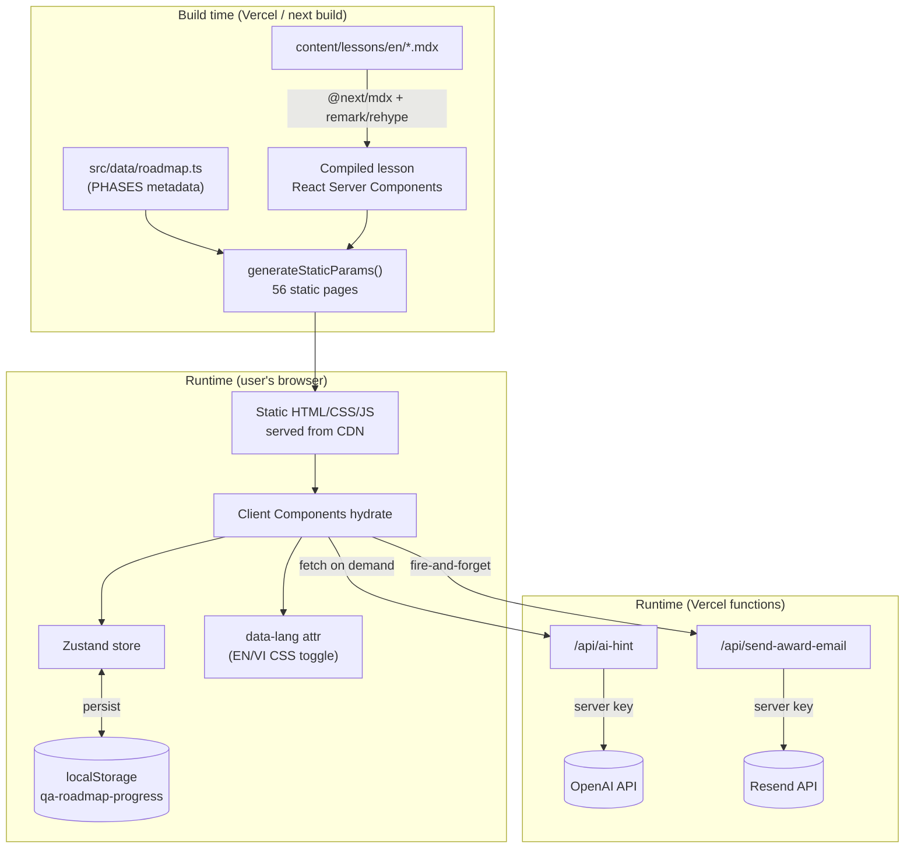

**Key flows:**

- **Reading a lesson:** 100% static. Browser gets pre-rendered HTML from the CDN; no server round-trip, no DB.
- **Progress / streak / points / purchases:** 100% client. `toggleDay()` in the Zustand store mutates local state and recomputes the streak via `src/lib/date.ts`; `persist` middleware writes to `localStorage`.
- **Bilingual toggle:** No re-render, no fetch. An inline `<script>` in `layout.tsx` sets `data-lang` before paint (anti-flash), and `<En>`/`<Vi>` wrappers are shown/hidden purely via CSS. Both languages ship in the HTML.
- **AI exercise review:** Client posts answers to `/api/ai-hint`; the function calls OpenAI server-side (key never reaches the browser) and returns a bilingual `{en, vi}` JSON. The result is cached back into the Zustand store (`aiAnswers`).
- **Reward email:** When a shop/phase reward is claimed, the client fire-and-forgets a POST to `/api/send-award-email`, which emails the admin to physically prepare the reward (a matcha drink). Failure is swallowed so it never blocks the UI.

### Build-time vs runtime behavior

| Concern | Build time | Runtime (browser) | Runtime (serverless) |
|---|---|---|---|
| Lesson HTML | ✅ rendered (SSG) | served from CDN | — |
| Lesson metadata | ✅ baked from `roadmap.ts` | — | — |
| Syntax highlighting | ✅ `rehype-pretty-code` | — | — |
| Progress / streak / points | — | ✅ Zustand + localStorage | — |
| Unlock/gating logic | — | ✅ `unlock.ts` (client) | — |
| AI exercise grading | — | triggers fetch | ✅ OpenAI proxy |
| Reward notification | — | triggers fetch | ✅ Resend email |

### Server Components vs Client Components

- **Server Components (default):** route pages (`page.tsx` for home, day, roadmap, progress, about), the MDX content itself, metadata generation.
- **Client Components (`'use client'`):** everything stateful/interactive — `LessonShell` (completion button, lock screen, nav), `Quiz`, `CodePlayground`, `ExerciseBox`, all of `progress/`, `roadmap/RoadmapTimeline`, modals (`ShopModal`, `PhaseRewardModal`), layout chrome (`Header`, `MobileNav`, theme/lang effects), and the store.
- The split is reasonable: static teaching content stays on the server; the gamified shell is client-side because it depends on `localStorage` state that only exists in the browser.

### State management

- **Single Zustand store** with `persist` + `partialize`. It holds: `completed[]`, `completedDates`, `streak`/`longestStreak`, `language`, `aiAnswers`, `aiHintUsed`, `totalPoints`, `quizPointsEarned`, `streakPointsDates`, `purchasedItems`, `phaseRewards`, plus transient `hydrated`/`devPreview`.
- `skipHydration: true` + an explicit `rehydrate()` in `StoreHydration` avoids SSR/CSR hydration mismatches — a correct, deliberate pattern.
- **The store is effectively the entire "user database," living in one browser tab's `localStorage`.**

### Reusable modules & domain boundaries (as they exist today)

- `lib/unlock.ts` — pure gating rules (day/phase locks). Clean, testable, no UI.
- `lib/date.ts` — streak/day-key math.
- `data/roadmap.ts` — curriculum structure (Phases → Days).
- `data/shopProducts.ts`, `data/motivation.ts` — reward catalog & copy.
- `components/lesson/*` — the MDX component library (`Quiz`, `Callout`, `CodePlayground`, `ExerciseBox`, `ResourceList`, `En/Vi`, etc.) registered in `mdx-components.tsx`.

### Strengths

1. **Right tool for the core job.** Teaching content is naturally static, versioned, reviewable in PRs, and SEO-friendly. MDX + SSG is close to ideal for that.
2. **Cheap and fast.** Static pages on a CDN → excellent TTFB/LCP, trivial scaling, near-zero hosting cost.
3. **Strong SEO.** Per-page `generateMetadata`, title templates, real pre-rendered HTML for all 56 lessons.
4. **No data-ops burden.** No DB to back up, migrate, secure, or page someone about at 2am.
5. **Thoughtful UX engineering.** Anti-flash language/theme scripts, route-aware loading skeletons (`loading.tsx`), hydration-safe store, content gating with friendly lock screens.
6. **Secrets handled correctly.** API keys live only in serverless functions, never shipped to the client.
7. **Clean front-end seams.** Feature-folder components and pure `lib/` logic mean the codebase is already easy to reason about.

### Weaknesses

1. **`localStorage` *is* the database.** All progress, streaks, points, and purchases are trapped in one browser. Clearing cache, switching devices, or using a different browser = total data loss. This is the single biggest limiter on every "platform" feature you listed (profiles, cross-device, leaderboards, real analytics).
2. **No identity.** Without auth you cannot do profiles, social features, payments, or trustworthy analytics. The "award email" reward loop is a manual, unverifiable side channel.
3. **Dual source of truth for metadata.** Lesson facts live in **both** MDX frontmatter **and** `roadmap.ts`, kept in sync by hand. Drift is inevitable as content grows.
4. **Hardcoded lesson registry.** `lib/lesson-loader.ts` is a 56-entry hand-written `import()` map. Every new lesson requires editing this file *and* `roadmap.ts`. This does not scale past one course.
5. **Single-course assumption baked into the domain.** `PHASES` is one global curriculum. There's no `Course` concept; a second course would require structural change.
6. **Pages import content directly.** `page.tsx` → `getLessonLoader()` → `import('*.mdx')`. There is no abstraction between "the page" and "where content comes from," so any future API-sourced content means touching page logic.
7. **Unprotected, paid serverless endpoint.** `/api/ai-hint` has no auth, no rate limit, and calls a paid API (OpenAI). It's directly abusable → cost/DoS risk.
8. **Client-trusted gamification.** Points, streaks, and "purchases" are computed and stored client-side. Anyone can edit `localStorage` to grant themselves rewards. Fine for a free honor-system app; **unacceptable the moment money or real rewards are involved.**
9. **Stale build artifacts & docs.** Committed `out/` directory and a README describing a no-backend static export that no longer matches reality.

### Technical debt (prioritized)

| Severity | Debt | Why it matters | Effort to fix |
|---|---|---|---|
| 🔴 High | `localStorage`-only user state | Blocks every future platform feature | Medium (needs auth + store) |
| 🟠 Med | Dual metadata source (frontmatter vs `roadmap.ts`) | Drift, manual sync | Low–Med (derive one from the other) |
| 🟠 Med | Hardcoded `lesson-loader` map | Manual, error-prone, single-course | Low (globbing/content registry) |
| 🟠 Med | No content abstraction layer | Forces page rewrites to add API content | Low (interface refactor) |
| 🟠 Med | Unauthenticated paid AI endpoint | Cost/abuse risk | Low (rate-limit + turnstile/auth) |
| 🟡 Low | Client-trusted points/purchases | Cheatable; only matters if monetized | Deferred until backend |
| 🟡 Low | Committed `out/`, stale README | Confusion | Trivial |

### Scalability concerns

- **Traffic scaling: already excellent.** Static CDN delivery scales effectively infinitely and cheaply. More readers ≠ more cost or risk.
- **Content scaling: moderate concern.** The hardcoded loader + dual metadata + single-course model mean *authoring* scales poorly. 56 lessons is fine by hand; 5 courses × 56 isn't.
- **Feature scaling: the real wall.** Everything on your "future requirements" list (profiles, progress sync, comments, ratings, payments, admin, real analytics) requires **server-owned, identity-bound, multi-user state** — which the current architecture structurally cannot provide. This is *not* a flaw to fix today; it's the boundary that tells you *when* to add a backend.

---

## Step 2 — Domain Analysis

Even though the app is small, it already contains clear domains. Naming them now makes the migration boundaries obvious later.

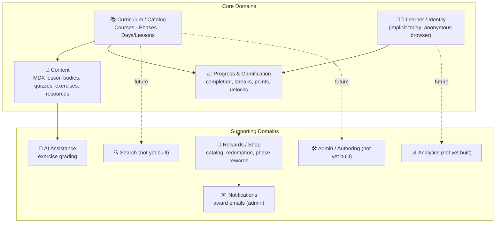

### Core domains

**1. Curriculum / Catalog** — *the structure of learning.*
The `Course → Phase → Day(Lesson)` hierarchy, ordering, unlock thresholds, tags, est. time, publish (`available`) flags. Today: `data/roadmap.ts`. This is the **spine** everything else hangs off. **Responsibility:** define what exists and in what order. **Boundary:** owns structure/metadata, *not* the prose body and *not* a user's progress through it.

**2. Content** — *the actual teaching material.*
The MDX body of each lesson: concepts, code demos, quizzes, exercises, resources, EN/VI text. Today: `content/lessons/en/*.mdx` + the `components/lesson/*` renderer library. **Responsibility:** deliver readable, interactive teaching material. **Boundary:** authored as code, rendered statically. It references a Day by `id` but does not own scheduling or progress.

**3. Learner / Identity** — *who is learning.*
**Currently implicit and anonymous** — "the learner" is just one browser's `localStorage`. This is the domain that *does not really exist yet* and whose absence blocks the platform vision. **Responsibility (future):** identity, profile, preferences, the anchor for all per-user data.

**4. Progress & Gamification** — *the relationship between a Learner and the Catalog.*
Completion set, completion dates, streak/longest-streak, total points, quiz/streak point ledgers, unlock state. Today: the Zustand store + `unlock.ts` + `date.ts`. **Responsibility:** track and gate a learner's journey, compute streaks/points. **Boundary:** depends on both Catalog (what can be completed) and Learner (whose progress), but should not contain content or catalog structure.

### Supporting domains

**5. Rewards / Shop** — reward catalog (`shopProducts.ts`), point redemption, per-phase rewards, purchase ledger. Depends on Progress (points balance) and triggers Notifications. *Today entirely client-trusted.*

**6. Notifications** — currently a single transactional flow: admin "prepare the reward" email via Resend. Future: learner-facing (streak reminders, new-content alerts).

**7. AI Assistance** — exercise/code grading via OpenAI (`/api/ai-hint`). A stateless enrichment over Content; cache of results lives in Progress today.

**8. Search** *(not built)* — over Catalog + Content. Has a natural cheap first implementation (static client-side index) before it ever needs a server.

**9. Analytics** *(not built)* — usage, funnel, completion rates. Impossible to do trustworthily without Identity.

**10. Admin / Authoring** *(not built)* — managing courses, publishing lessons, moderating comments. For content, "admin" today = a Git PR. That's a feature, not a gap, until non-engineers must author.

### Why these boundaries matter for migration

The dependency arrows above are the **migration seams**. Notice that **Catalog and Content are upstream of everything and depend on nothing user-specific** — which is exactly why they can *stay in MDX/Git permanently*. Everything downstream of **Learner** (Progress, Rewards, social, analytics, payments) is **inherently multi-user, server-owned state** — which is exactly what a backend is for. The architecture practically draws its own line: **content on one side, identity-bound state on the other.**

---

## Step 3 — Is a Dedicated Backend Actually Needed?

The honest answer requires separating **"do you need server-owned state?"** (a *capability* question) from **"do you need a dedicated, custom-built backend service?"** (an *architecture* question). They are not the same, and conflating them is how teams end up building a microservice to store three booleans.

### The decisive test

> **A backend earns its place the moment you have state that must be (a) shared across devices/users, (b) trusted (not editable by the client), or (c) queried across users.** Until a feature needs one of those three, a backend is pure overhead.

Let's apply it.

### Current requirements

| Capability today | Needs server state? | Verdict |
|---|---|---|
| Read 56 lessons | No — static is ideal | **No backend** |
| EN/VI toggle | No — CSS/client | **No backend** |
| Progress / streak / points | Shared across devices? Not *required* today (single-device honor system) | **No backend** *(by current product choice)* |
| AI exercise grading | Needs a server to hide the API key | **Function only** (already have it) |
| Reward email | Needs a server to hide the key | **Function only** (already have it) |

**Conclusion for today: you need *serverless functions* (you have them), not a *backend service*.** Nothing in the current product crosses the decisive test except secret-keeping, which a function already solves.

### Future requirements — re-run the test

| Future feature | (a) Cross-device | (b) Must be trusted | (c) Cross-user query | Needs backend? |
|---|---|---|---|---|
| **Authentication** | ✅ | ✅ | ✅ | **Yes** (this is the unlock) |
| User profiles | ✅ | ✅ | — | Yes |
| Progress tracking (synced) | ✅ | partly | — | Yes |
| Bookmarks / favorites | ✅ | — | — | Yes |
| Comments / discussions | ✅ | ✅ | ✅ | Yes |
| Ratings / reviews | ✅ | ✅ | ✅ (averages) | Yes |
| Analytics | ✅ | ✅ | ✅ | Yes (or 3rd-party) |
| Search | — | — | — | **No** (start static) |
| Admin / content mgmt | depends | ✅ | ✅ | Maybe (Git/CMS first) |
| Notifications | ✅ | ✅ | — | Yes |
| Payments / subscriptions | ✅ | ✅✅✅ | ✅ | **Yes, and trusted** |

**The pattern is unmistakable:** almost every future feature crosses the test — but they **all cross it at the same gate: authentication.** There is no point building profiles, sync, comments, or payments before identity exists. So the question "do we need a backend?" collapses into **"when do we add auth?"** And auth is a *managed* capability — you should not hand-roll it.

### Scalability requirements

- **Read scalability** is already solved by the CDN and stays solved — content delivery never needs the backend.
- **Write scalability** (progress saves, comments, ratings) is modest for an education app: a learner completes ~1–2 lessons/day. This is **low-write, read-mostly** — comfortably inside the free/cheap tier of any managed database or BaaS for a long time.
- You are nowhere near the scale that justifies a custom service for *performance* reasons. When/if you are, it's a happy problem with budget attached.

### Operational complexity

A dedicated .NET service means: a container/host to run, a deploy pipeline, a database to provision and back up, secrets management, logging/metrics/alerting, security patching, CORS, and an on-call expectation. For a **solo/small team shipping a free course**, that is a large standing tax. A **managed BaaS (e.g., Supabase/Firebase/Auth.js + hosted Postgres)** collapses most of that to configuration.

### Maintenance cost

- **MDX content:** ~zero maintenance; it's just files in Git.
- **BaaS-backed features:** low — you maintain schema and a thin API layer, the provider maintains the runtime.
- **Custom .NET service:** highest — you own the entire stack lifecycle. Justified only when the **domain logic** (billing, reporting, complex authorization, editorial workflow) is itself complex enough to need a real application layer.

### Team productivity & development velocity

This is decisive and codebase-specific: the repo is **TypeScript/React end-to-end**. Introducing **C#/.NET now** means a second language, a second toolchain, a second mental model, and context-switching — for features (auth, a few CRUD tables) that a TypeScript-native BaaS delivers in a fraction of the time. **Velocity argues strongly for staying in the JS/TS ecosystem until the domain complexity genuinely warrants a dedicated service.**

### Verdict

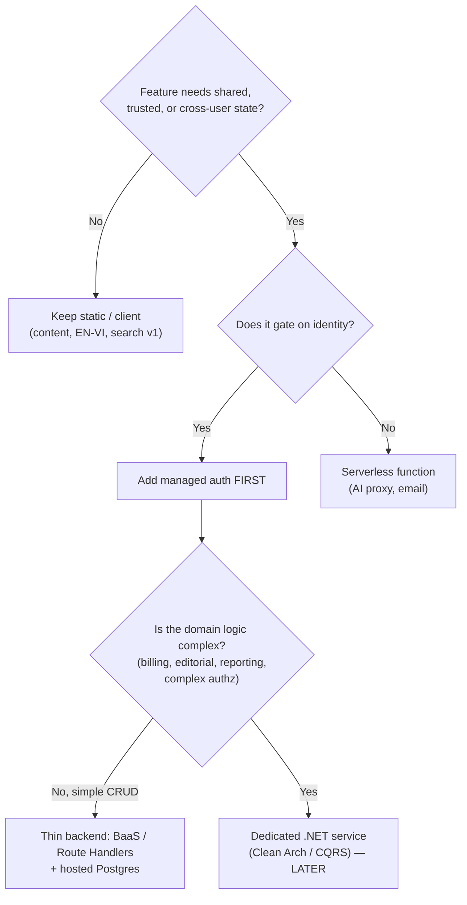

**Do you need a dedicated backend today? No.** You need (1) the functions you already have, and (2) a **plan** to add **managed auth + a thin data layer** at the moment you commit to cross-device accounts. A custom .NET service is a *destination*, not a *starting point* — and only if domain complexity arrives to justify it.

---

## Step 4 — Architecture Options Compared

Three options, evaluated objectively against *this* project.

### Option A — Next.js Only (App Router + Route Handlers + Server Actions + direct DB)

Keep one Next.js app. Add auth (Auth.js/Clerk), a hosted Postgres (Neon/Supabase/Vercel Postgres), and talk to it from **Route Handlers / Server Actions**. MDX content stays as-is.

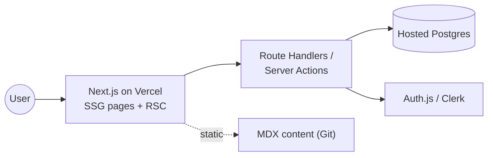

- **Pros:** One language, one repo, one deploy. Server Actions remove most API boilerplate. Co-located with the content site → shared types, shared auth session in RSC. Lowest cognitive load; fastest to ship. Cheapest to operate. Excellent DX.
- **Cons:** Business logic can sprawl across route handlers if undisciplined. Vendor-leaning (Vercel). Not ideal if you later need heavy background jobs, a non-web consumer, or a separate backend team. Testing pure domain logic is less natural than in a layered backend.
- **Scalability:** Reads scale via CDN; writes scale with the managed DB. More than enough for an ed-platform for years.
- **Complexity:** **Lowest.**
- **Maintainability:** High *if* you keep a thin service/`lib` layer so logic isn't dumped in route files.
- **Cost:** **Lowest** (often free tier well into real usage).

### Option B — Next.js + Dedicated ASP.NET Core Backend (Clean Architecture + Vertical Slice + CQRS)

Next.js becomes a pure front-end (BFF for SSR) calling a separate **ASP.NET Core** API implementing Clean Architecture, vertical slices, CQRS via MediatR, EF Core over Postgres/SQL Server.

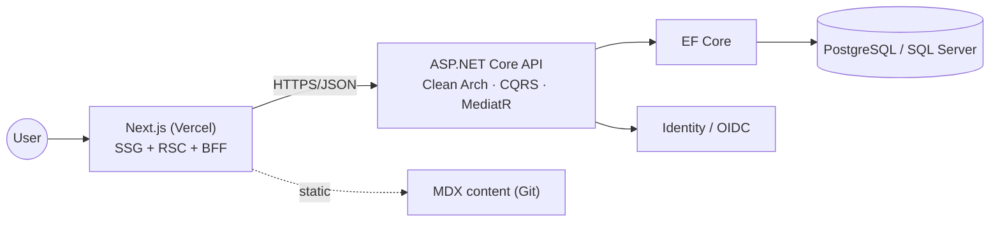

- **Pros:** Strong separation of concerns; domain logic is first-class, highly testable, framework-independent. CQRS + vertical slices scale *organizationally* (many features/teams) and handle complex workflows (billing, reporting, editorial) cleanly. Backend reusable by other clients (mobile, partners). Mature, enterprise-grade ecosystem.
- **Cons:** **Two languages, two runtimes, two deploy pipelines.** Significant standing ops + cognitive overhead. Network hop between Next and API. For simple CRUD it's enormous ceremony. Slows early velocity for a solo/small team. Highest cost.
- **Scalability:** Excellent — including organizational and complex-domain scalability that Option A lacks.
- **Complexity:** **Highest.**
- **Team productivity:** **Lowest early**, **highest at large scale with a dedicated backend team** and genuinely complex domain.
- **Long-term maintainability:** Excellent *if* the domain complexity justifies the structure; otherwise it's overhead you maintain forever.

### Option C — Hybrid (recommended): static MDX + incremental managed backend behind a content abstraction

Keep the static MDX content site exactly as-is. Introduce a **content-provider abstraction** so pages are decoupled from content origin. Add **managed auth + a thin data layer** (BaaS or Next.js Route Handlers/Server Actions + hosted Postgres) **only for identity-bound state**, feature by feature. Keep the **.NET Clean-Architecture service in your back pocket** as the destination *if and when* domain complexity (payments at scale, editorial CMS, reporting, multi-client API) actually arrives.

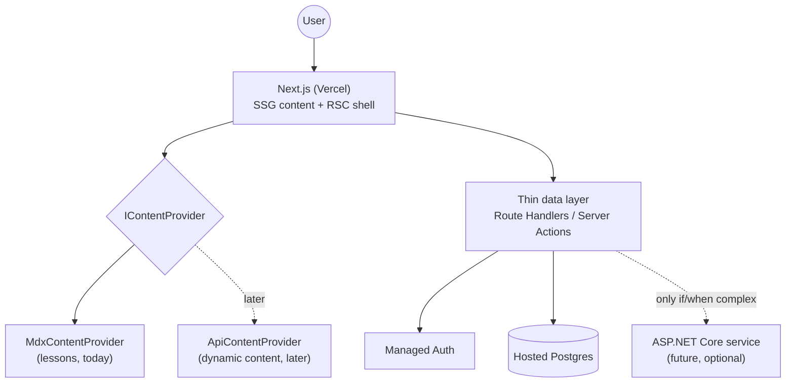

- **Pros:** Preserves everything that works (content, SEO, cost, speed). Adds capability **incrementally and reversibly**. Lowest risk: the live site never stops working. Keeps you in TS for as long as that's optimal, with a clear, *pre-designed* escalation path to .NET when justified. The abstraction means later swaps don't touch page logic.
- **Cons:** Requires discipline to keep boundaries clean (the abstraction must be respected). "Hybrid" can rot into "ad hoc" without governance. You carry an *option* on .NET rather than a built system — fine, as long as the team agrees on the trigger conditions.
- **Scalability:** Inherits Option A's scaling now; inherits Option B's scaling *later* exactly when needed.
- **Complexity:** **Low now, grows only with proven need.**
- **Maintainability & velocity:** **Best risk-adjusted** for this project's current size and trajectory.

### Side-by-side

| Criterion | A: Next.js only | B: Next.js + .NET | C: Hybrid (incremental) |
|---|---|---|---|
| Time-to-first-feature | 🟢 Fast | 🔴 Slow | 🟢 Fast |
| Operational overhead | 🟢 Low | 🔴 High | 🟢 Low → grows |
| Handles complex domain (billing/editorial) | 🟡 OK w/ discipline | 🟢 Excellent | 🟢 via .NET escalation |
| Languages/toolchains | 🟢 1 | 🔴 2 | 🟢 1 → 2 only if needed |
| Risk to live site | 🟢 Low | 🟠 Medium | 🟢 Lowest |
| Cost | 🟢 Lowest | 🔴 Highest | 🟢 Low → scales |
| Reusable by other clients (mobile/partners) | 🟡 via API routes | 🟢 Yes | 🟢 when escalated |
| Best fit *now* | Good | Overkill | ✅ **Best** |

**Option C is Option A with a deliberately pre-drawn door to Option B.** That's the recommendation, detailed in Steps 5–7.

---

## Step 5 — Hybrid Content Strategy (feature by feature)

This is the heart of the recommendation. The guiding principle:

> **Static, authored, one-to-many, read-mostly, SEO-relevant → MDX.**
> **Per-user, dynamic, trusted, cross-user, write-heavy → Backend.**
> **Authored skeleton + per-user/dynamic overlay → Hybrid.**

| Feature | Keep MDX | Move to Backend | Hybrid | Reason |
|---|:---:|:---:|:---:|---|
| **Courses** | ✅ (structure in `roadmap.ts`/MDX) | | ▶ later | The single course is authored content. Keep as code now. Becomes **Hybrid** only when non-engineers must create courses or you sell per-course access (then catalog metadata → DB, bodies stay MDX). |
| **Lessons** | ✅ | | | Long-form teaching prose with code, quizzes, EN/VI. This is MDX's sweet spot: versioned, reviewable, SEO-rendered, zero-cost. **Never move the lesson *body* to a DB** — you'd lose Git history, PR review, and rich interactive components for no gain. |
| **Roadmaps** | ✅ | | | Curriculum structure = authored data. Stays in `roadmap.ts` (ideally derived from frontmatter to kill the dual source). |
| **Documentation** | ✅ | | | Same as lessons — static, SEO-valuable, authored. Pure MDX forever. |
| **Blog posts** | ✅ | | ▶ maybe | Default MDX (great SEO, zero ops). Go **Hybrid** only if non-technical authors need a CMS with scheduling/drafts — then a headless CMS feeds the same renderer. |
| **User profiles** | | ✅ | | Per-user, identity-bound, must persist server-side and sync across devices. Impossible in MDX. Pure backend. |
| **Progress tracking** | | ✅ | ▶ transitional | The *catalog* it references stays MDX; the *progress records* are per-user trusted state → backend. **Hybrid during migration:** keep localStorage as an offline cache / fallback, with the DB as source of truth (read Step 11). |
| **Comments / discussions** | | ✅ | | Multi-user, moderated, cross-user queryable, real-time-ish. Classic backend. (MDX could *render* a comments component, but the data is backend.) |
| **Ratings / reviews** | | ✅ | | Aggregations across users (averages, counts), trusted (no client-side inflation). Backend. |
| **Analytics** | | ✅ (or 3rd-party) | | Cross-user aggregation, must be trustworthy. Use a managed product (Plausible/PostHog/GA4) first; custom event store only if you outgrow it. |
| **Search** | | | ✅ | **Start static** — build a JSON index from MDX at build time, search client-side (Fuse.js/FlexSearch). Zero backend. Escalate to a search service (Algolia/Meilisearch/Postgres FTS) only when the corpus or query complexity outgrows a client index. |
| **Notifications** | | ✅ | | Per-user, event-driven, server-sent. The existing Resend function is the seed; learner-facing notifications need identity + a backend trigger. |
| **Admin features** | | | ✅ | **Authoring admin = Git/PR today** (keep it — it's a feature). **Operational admin** (moderate comments, manage users, view orders) needs a backend UI. So: content-admin stays MDX/Git; user/data-admin → backend. |
| **Payments / subscriptions** | | ✅ | | The most trust-critical feature. Must be server-validated, never client-trusted. Backend + payment provider (Stripe). Gate MDX content access via entitlement checks at the edge/server. |

### What this means in plain terms

- **Stays MDX permanently:** lesson bodies, documentation, roadmap structure, blog (default). These are your durable, SEO-driving, low-cost assets. Moving them to a DB is *strictly worse*.
- **Moves to backend (when its gate arrives):** profiles, synced progress, comments, ratings, notifications, payments, operational analytics/admin — everything identity-bound or trust-critical.
- **Hybrid by nature:** search (static→service), courses/catalog (code→DB metadata while bodies stay MDX), progress during the transition (localStorage cache + DB truth).
- **Never migrate:** the *authoring-as-code workflow* for teaching content. Even with a backend, lessons should remain MDX in Git. A headless CMS is the *only* reason to revisit this, and only for non-technical authors.

---

## Step 6 — Content Abstraction Strategy

### The problem it solves

Today, `app/day/[id]/page.tsx` reaches directly into `getLessonLoader(id)` which directly `import()`s an MDX file. **The page knows the content lives in a file.** That coupling means the day you want *any* content to come from an API (e.g., a CMS-authored lesson, or A/B-tested copy, or a premium lesson behind entitlement), you must rewrite page logic. The fix is a classic **provider/strategy abstraction**: pages depend on an *interface*, not on MDX.

### The design

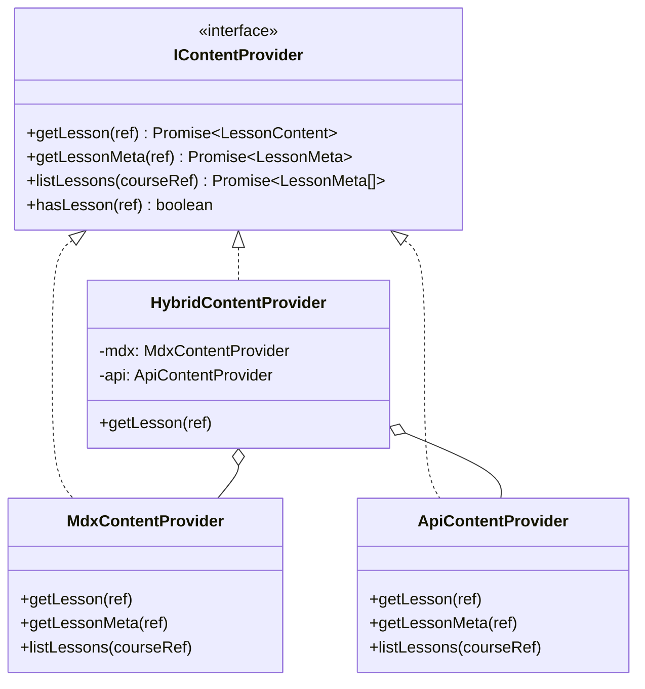

A minimal, framework-honest interface (note: an MDX body resolves to a **React component**, so the contract returns a renderable component, not an HTML string):

```typescript
// src/content/types.ts
export interface LessonRef { courseSlug: string; dayId: number; locale?: 'en' | 'vi' }

export interface LessonMeta {
  dayId: number
  title: string;  titleVi: string
  blurb: string;  blurbVi: string
  phaseId: number
  estMinutes: number
  tags: string[]
  available: boolean
  source: 'mdx' | 'api'        // provenance, useful for debugging/telemetry
}

export interface LessonContent {
  meta: LessonMeta
  Body: React.ComponentType       // MDX-compiled component OR API-rendered MDX
}

export interface IContentProvider {
  hasLesson(ref: LessonRef): boolean | Promise<boolean>
  getLessonMeta(ref: LessonRef): Promise<LessonMeta | null>
  getLesson(ref: LessonRef): Promise<LessonContent | null>
  listLessons(courseSlug: string): Promise<LessonMeta[]>
}
```

```typescript
// src/content/MdxContentProvider.ts — wraps TODAY's behavior, no behavior change
import { getLessonLoader } from '@/lib/lesson-loader'
import { getDayById } from '@/data/roadmap'

export class MdxContentProvider implements IContentProvider {
  hasLesson({ dayId }: LessonRef) { return !!getLessonLoader(dayId) }
  async getLessonMeta({ dayId }: LessonRef) { /* map getDayById(dayId) -> LessonMeta */ }
  async getLesson(ref: LessonRef) {
    const loader = getLessonLoader(ref.dayId); if (!loader) return null
    const { default: Body } = await loader()
    const meta = await this.getLessonMeta(ref)
    return meta && { meta, Body }
  }
  async listLessons() { /* derive from PHASES */ }
}
```

```typescript
// src/content/index.ts — the ONLY thing pages import
export const content: IContentProvider = new MdxContentProvider()
// Later: = new HybridContentProvider(new MdxContentProvider(), new ApiContentProvider())
```

The page then becomes provider-agnostic:

```typescript
// app/day/[id]/page.tsx (after)
import { content } from '@/content'

export default async function DayPage({ params }: { params: { id: string } }) {
  const lesson = await content.getLesson({ courseSlug: 'qa', dayId: Number(params.id) })
  if (!lesson) notFound()
  const { Body } = lesson
  return <LessonShell dayId={lesson.meta.dayId}><article className="prose ..."><Body /></article></LessonShell>
}
```

`HybridContentProvider` implements the routing policy — e.g., "if the API has a published override for this lesson use it, else fall back to MDX":

```typescript
// src/content/HybridContentProvider.ts
export class HybridContentProvider implements IContentProvider {
  constructor(private mdx: IContentProvider, private api: IContentProvider) {}
  async getLesson(ref: LessonRef) {
    if (await this.api.hasLesson(ref)) return this.api.getLesson(ref)  // CMS/premium override
    return this.mdx.getLesson(ref)                                     // default: static MDX
  }
  // meta/list similarly merge API over MDX
}
```

### Benefits

- **Pages never change again** when content origin changes. You swap one line in `src/content/index.ts`.
- **Strangler-fig migration:** introduce API content lesson-by-lesson; everything not yet migrated transparently falls back to MDX. The site never breaks.
- **Testability:** pages can be tested against a `FakeContentProvider`.
- **Provenance & telemetry:** `meta.source` lets you measure and debug mixed content.
- **Preserves SSG:** with `MdxContentProvider`, `generateStaticParams` + `getLessonMeta` still pre-render everything exactly as today. An API provider can still be statically rendered at build (ISR/SSG) for SEO parity.

### Trade-offs

- **A thin indirection layer** to maintain (small, and it replaces the ad-hoc `lesson-loader` coupling rather than adding to it).
- **Discipline required:** pages must go through `content`, never `import('*.mdx')` directly. Enforce with an ESLint rule/`no-restricted-imports`.
- **The async contract:** today's `getLessonLoader` is sync-ish; the interface is `Promise`-based to allow API providers. Negligible cost in RSC (already async).
- **Static-export caveat:** an `ApiContentProvider` must render at build time (SSG/ISR) to keep SEO and zero-runtime-cost guarantees — don't let "API content" silently become client-fetched and unindexed.

### Migration advantages (why do this *now*, before any backend)

Doing this refactor **before** you have a backend is the cheapest it will ever be: it's a pure front-end change with **no behavioral difference** (MdxContentProvider just wraps what exists). It simultaneously pays down two existing debts — the **hardcoded `lesson-loader` map** and the **direct page→file coupling** — and it makes the entire future migration a series of *additive*, *reversible* steps behind a stable interface. This is the single highest-leverage, lowest-risk thing you can do today.

---

## Step 7 — Recommended Architecture

### The choice: **Hybrid (Option C)** — "Static-content core + incremental managed backend behind a content abstraction."

Concretely, the target architecture for the next ~2 years:

- **Front-end & content:** Next.js 14 App Router on Vercel. Lessons/docs/roadmap stay **MDX/SSG**, accessed through `IContentProvider`.
- **Identity:** a **managed auth provider** (Auth.js with a DB adapter, or Clerk/Supabase Auth). Never hand-rolled.
- **Data layer:** Next.js **Route Handlers + Server Actions** over a **hosted Postgres** (Neon/Supabase/Vercel Postgres) via a typed query layer (Drizzle/Prisma), organized as a thin **service layer** (`src/server/<domain>/`) so logic isn't smeared across route files.
- **Functions:** existing `/api/ai-hint` and `/api/send-award-email`, now **authenticated + rate-limited**.
- **Search:** build-time static index, client-side query — until it must escalate.
- **Analytics:** managed (PostHog/Plausible) first.
- **Escalation door:** a **dedicated ASP.NET Core service (Clean Arch/CQRS)** is introduced **only if** a domain arrives whose complexity the thin layer can't carry cleanly — realistically **payments-at-scale + editorial CMS + cross-client API + reporting**. Steps 8–10 are its blueprint.

### Why it's the best fit

1. **It preserves 100% of what already works** — content, SEO, speed, cost, the gamified UX — and never requires a "stop the world" rewrite.
2. **It adds capability exactly when justified**, gated on the one real unlock (auth), so you never carry infrastructure ahead of need.
3. **It stays in one language** until domain complexity (not feature count) forces otherwise, maximizing the small-team velocity this project actually has.
4. **It's reversible at every step** thanks to the content abstraction and additive feature phasing.
5. **It has a pre-drawn escalation path** to enterprise-grade .NET, so "we might need a real backend later" is a *planned door*, not a future crisis.

### Why the alternatives were rejected

- **Pure Option A (Next.js only) — not rejected so much as *subsumed*.** The Hybrid *is* Option A for the foreseeable future; the only difference is that Hybrid explicitly keeps content in MDX and pre-commits to the .NET escalation criteria. If you never hit those criteria, Hybrid and Option A are identical — which is fine.
- **Option B (build .NET now) — rejected for *now*.** It front-loads the highest complexity, cost, and language-switching tax to deliver simple CRUD and auth that a managed TS stack delivers faster. It optimizes for a scale and domain complexity you do not yet have. Adopting it prematurely would *slow* the product and *raise* operational risk. It remains the correct *destination* under specific triggers (Step 13).

### Expected growth path (next few years)

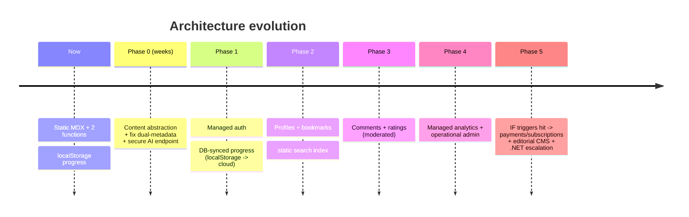

### System diagram (target)

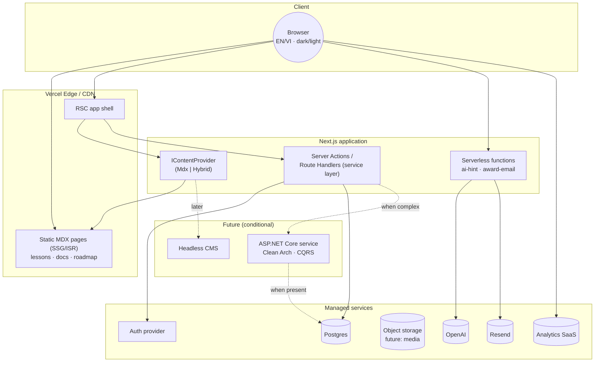

### Component diagram (Next.js app internals, target)

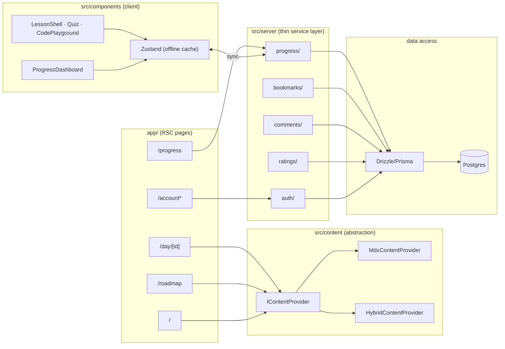

### Deployment diagram (target)

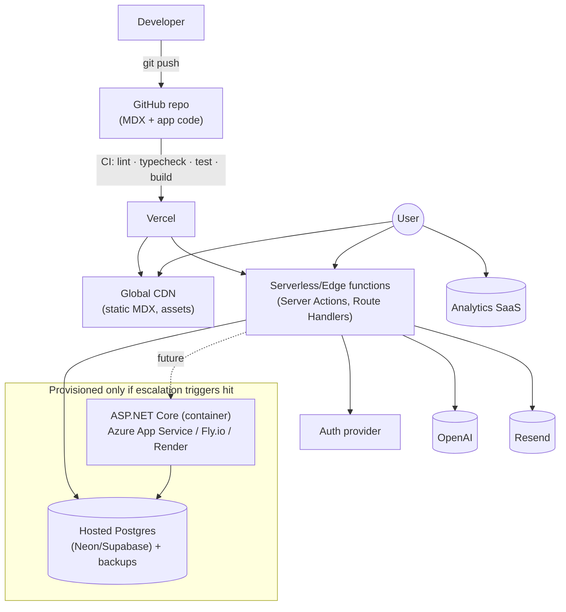

---

## Step 8 — Backend Design (Future Blueprint)

> **Read this as the destination, not the next sprint.** Build it only when the escalation triggers in Step 13 fire. When that day comes, this is the structure I'd stand up: **ASP.NET Core + Clean Architecture + Vertical Slice + CQRS (MediatR) + EF Core.** Until then, the same domain logic lives in the thin TS service layer (`src/server/*`), and this blueprint is what you "graduate" it into.

### Guiding principles

- **Clean Architecture** for dependency direction: dependencies point **inward**; the Domain knows nothing about EF, HTTP, or MediatR.
- **Vertical Slice** for organization: code is grouped **by feature**, not by technical layer, so a feature is a cohesive folder rather than scattered across `Controllers/`, `Services/`, `Repositories/`.
- **CQRS** where it pays: separate **Commands** (writes, with side effects/validation) from **Queries** (reads, often projection-optimized). Not every entity needs it — apply to features with real read/write asymmetry (progress, comments, reporting).

### Folder structure

```
src/
├── Api/                         # Thin HTTP host. Composition root.
│   ├── Program.cs               # DI wiring, middleware, auth, MediatR, EF registration
│   ├── Endpoints/               # Minimal API endpoint maps (one file per feature)
│   │   ├── ProgressEndpoints.cs
│   │   ├── BookmarkEndpoints.cs
│   │   ├── CommentEndpoints.cs
│   │   └── ...
│   ├── Middleware/              # Exception handling, request logging, correlation IDs
│   ├── Auth/                    # JWT/OIDC config, policy definitions
│   └── appsettings.json
│
├── Features/                    # VERTICAL SLICES — the heart of the app
│   ├── Courses/
│   │   ├── Domain/              # Course, Phase entities + invariants (no EF attributes)
│   │   ├── GetCourse/           # Query + Handler + Response DTO + Validator
│   │   ├── ListCourses/
│   │   └── PublishLesson/       # Command + Handler (editorial)
│   ├── Lessons/
│   │   ├── Domain/              # LessonMeta entity (body stays MDX/CMS, NOT here)
│   │   ├── GetLessonMeta/
│   │   └── SyncLessonCatalog/   # ingest catalog from MDX frontmatter / CMS
│   ├── LearningPaths/
│   │   ├── Domain/
│   │   └── GetLearningPath/
│   ├── Users/
│   │   ├── Domain/              # User, Profile entities
│   │   ├── GetProfile/
│   │   └── UpdateProfile/
│   ├── Progress/
│   │   ├── Domain/              # LessonProgress, Streak value object, points ledger
│   │   ├── CompleteLesson/      # Command: idempotent, recomputes streak server-side
│   │   ├── UncompleteLesson/
│   │   ├── GetUserProgress/     # Query: projection for dashboard
│   │   └── RecalculateStreak/
│   ├── Bookmarks/
│   │   ├── AddBookmark/  RemoveBookmark/  ListBookmarks/
│   ├── Comments/
│   │   ├── Domain/              # Comment, ModerationStatus
│   │   ├── PostComment/  EditComment/  DeleteComment/  ListComments/  ModerateComment/
│   ├── Ratings/
│   │   ├── Domain/              # Rating, aggregate (avg, count)
│   │   ├── SubmitRating/  GetLessonRatingSummary/
│   ├── Notifications/
│   │   ├── SendAwardEmail/      # (graduates the existing Resend function)
│   │   └── EnqueueReminder/
│   └── Payments/                # only if monetized
│       ├── Domain/              # Subscription, Entitlement, Order
│       ├── CreateCheckout/  HandleWebhook/  CheckEntitlement/
│
├── Infrastructure/             # Implementation details behind Domain interfaces
│   ├── Persistence/
│   │   ├── AppDbContext.cs      # EF Core DbContext
│   │   ├── Configurations/      # IEntityTypeConfiguration<T> (mapping lives HERE, not in Domain)
│   │   ├── Migrations/
│   │   └── Repositories/        # only where a repository abstraction adds value
│   ├── Identity/               # ASP.NET Identity / external OIDC integration
│   ├── Email/                  # Resend/SMTP client implementing IEmailSender
│   ├── Ai/                     # OpenAI client implementing IAiReviewer
│   ├── Search/                 # Meilisearch/Algolia adapter (if escalated)
│   └── DependencyInjection.cs  # AddInfrastructure() extension
│
└── Shared/                     # Cross-cutting, dependency-free building blocks
    ├── Kernel/                 # Result<T>, Error, Entity base, ValueObject, IDomainEvent
    ├── Behaviors/              # MediatR pipeline: Validation, Logging, Transaction, Caching
    ├── Contracts/             # Shared DTO contracts (also published to the TS client)
    └── Abstractions/          # IDateTime, ICurrentUser, IEmailSender, IAiReviewer interfaces
```

### Responsibility · dependencies · rationale, per folder

| Folder | Responsibility | Depends on | Rationale |
|---|---|---|---|
| **`Api/`** | HTTP host & composition root: routing, auth, DI, middleware. Maps endpoints → MediatR. | `Features`, `Infrastructure`, `Shared` | Keep it **thin** — no business logic. Endpoints just translate HTTP↔Command/Query. Minimal APIs keep ceremony low. |
| **`Features/<X>/Domain/`** | Entities, value objects, invariants, domain events for the slice. | `Shared/Kernel` only | **Pure domain** — no EF, no MediatR, no HTTP. This is the innermost ring; it must be unit-testable with zero infrastructure. |
| **`Features/<X>/<UseCase>/`** | One Command or Query + its Handler + request/response DTO + validator. | `Domain`, `Shared`, abstractions | **Vertical slice + CQRS.** Each use case is self-contained → easy to find, change, test, and delete. Adding a feature = adding a folder, not editing 5 shared files. |
| **`Infrastructure/Persistence/`** | EF Core `DbContext`, entity configurations, migrations, repositories. | `Features/*/Domain` (to map), `Shared` | EF concerns live **here**, behind interfaces, so Domain stays persistence-ignorant. Mapping via `IEntityTypeConfiguration` keeps entities clean. |
| **`Infrastructure/{Identity,Email,Ai,Search}/`** | Concrete adapters for external services implementing `Shared/Abstractions` interfaces. | `Shared/Abstractions` | **Dependency inversion**: Domain/Handlers depend on `IEmailSender`/`IAiReviewer`, not on Resend/OpenAI SDKs. Swappable and mockable. |
| **`Shared/Kernel/`** | `Result<T>`, `Error`, base `Entity`/`ValueObject`, domain-event marker. | nothing | A tiny, stable, dependency-free core every slice can rely on. Encourages railway-oriented error handling over exceptions for control flow. |
| **`Shared/Behaviors/`** | MediatR pipeline behaviors: validation, logging, transactions, caching. | MediatR, `Shared` | **Cross-cutting once, not per-handler.** E.g., a `ValidationBehavior` runs FluentValidation before every handler; a `TransactionBehavior` wraps commands in a UoW. |
| **`Shared/Contracts/`** | DTOs shared across features and **exported to the TS front-end** (via OpenAPI/NSwag). | nothing | Single source of truth for the API contract → generated, type-safe TS client. Keeps Next.js and .NET in lockstep. |
| **`Shared/Abstractions/`** | Interfaces for time, current user, email, AI, etc. | nothing | Lets handlers be deterministic and testable (`IDateTime` instead of `DateTime.Now` — directly relevant to your streak logic). |

### How today's logic maps in

- `src/lib/unlock.ts` → `Features/Progress/Domain` (unlock rules become domain methods) + a `GetUserProgress` query projection.
- `src/lib/date.ts` streak math → `Progress/Domain/Streak` value object, driven by `IDateTime` (deterministic, testable).
- `store.ts` reducers (points, quiz points, streak points, purchases) → `CompleteLesson`, `SubmitRating`, reward commands — now **server-authoritative** (uncheatable).
- `/api/ai-hint` → `Features/Notifications`/a `ReviewExercise` command behind `IAiReviewer`.
- `/api/send-award-email` → `Features/Notifications/SendAwardEmail` behind `IEmailSender`.

---

## Step 9 — Database Design

Designed for Postgres. Works identically whether accessed by the **thin TS layer (Drizzle/Prisma)** or the **future EF Core** service — the schema is the contract.

### Design principles

- **Content bodies are NOT in the DB.** The DB stores **catalog metadata** and **per-user state**, and references lessons by a stable `(course_id, day_number)` natural key that matches the MDX/`roadmap.ts` identity. Lesson prose stays in MDX. This is the physical embodiment of the hybrid strategy.
- **Everything user-owned hangs off `users.id`.**
- **Idempotency & ledgers:** points are an append-only ledger (auditable, uncheatable) rather than a single mutable integer, so a compromised client can't fabricate a balance.

### ERD

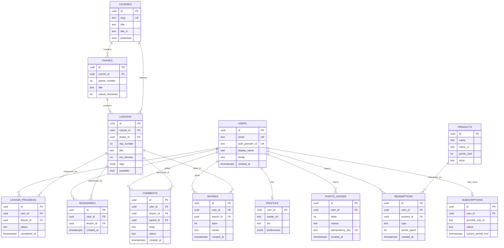

### Indexing strategy

| Table | Index | Why |
|---|---|---|
| `users` | unique(`email`), unique(`auth_provider_id`) | login lookups |
| `lessons` | unique(`course_id`,`day_number`); index(`phase_id`) | the natural key bridging MDX↔DB; phase queries |
| `lesson_progress` | unique(`user_id`,`lesson_id`); index(`user_id`,`completed_at`) | one row per user/lesson (idempotent completes); dashboard + streak scans |
| `bookmarks` | unique(`user_id`,`lesson_id`) | prevent dupes; list-by-user |
| `comments` | index(`lesson_id`,`status`,`created_at`); index(`parent_id`) | render approved threads fast |
| `ratings` | unique(`user_id`,`lesson_id`); index(`lesson_id`) | one rating per user/lesson; aggregate per lesson |
| `points_ledger` | unique(`idempotency_key`); index(`user_id`,`created_at`) | exactly-once awards; balance = SUM(delta) |
| `redemptions` | index(`user_id`,`created_at`) | history |
| `subscriptions` | unique(`provider_sub_id`); index(`user_id`,`status`) | webhook reconciliation; entitlement checks |

### Performance considerations

- **Streak & points are derived, but cached.** Compute streak from `lesson_progress.completed_at` and balance from `SUM(points_ledger.delta)`. For hot paths (dashboard), keep a **denormalized `user_stats`** row (current_streak, longest_streak, points_balance) updated transactionally with each command. Source of truth stays the ledger; the cache stays fast.
- **Comment counts / rating averages** → maintain a small `lesson_stats` rollup (avg_stars, ratings_count, comments_count) updated on write, so lesson pages never aggregate at read time.
- **Read-mostly workload** → lean on Postgres read replicas + HTTP/ISR caching long before any exotic scaling.

### Future scalability

- **Multi-course / multi-tenant:** the `courses` root is already there; adding courses is data, not schema change. A `tenant_id` can be introduced later if you sell white-label.
- **Partitioning:** `points_ledger` and `lesson_progress` are the only high-row-count tables; partition by time or hash(`user_id`) if they ever get large.
- **Analytics offload:** stream events to a warehouse (BigQuery/ClickHouse) rather than analytic-querying the OLTP DB.

---

## Step 10 — API Design

REST over HTTPS, JSON. The same contract is implemented by the thin TS layer now and could be served by .NET later **without the front-end noticing** (that's the point of versioning + the content abstraction).

### Conventions

- **Base & versioning:** URI-versioned, `/.../api/v1/...`. Version only on breaking changes; additive fields are non-breaking. Publish an OpenAPI spec; generate the TS client from it.
- **Auth:** session cookie (Auth.js) or `Authorization: Bearer <jwt>`. All `/me/*` routes require auth.
- **Errors:** RFC 9457 `application/problem+json` (`type`, `title`, `status`, `detail`, `errors`).
- **Idempotency:** mutating "award/complete" calls accept an `Idempotency-Key` header.
- **Pagination:** cursor-based (`?cursor=&limit=`) for lists (comments).

### Authentication

| Method | Path | Body / Notes |
|---|---|---|
| `GET` | `/api/v1/auth/session` | → current user or `null` |
| `POST` | `/api/v1/auth/signout` | clears session |
| (OAuth/email-link handled by the provider's routes) | | Don't hand-roll credential storage |

### Users

```
GET   /api/v1/me                      -> UserProfileResponse
PATCH /api/v1/me                      <- UpdateProfileRequest
GET   /api/v1/users/{id}/public       -> PublicProfileResponse   (for comment authorship)
```

```jsonc
// UpdateProfileRequest
{ "displayName": "string", "locale": "en|vi", "bio": "string?", "avatarUrl": "string?" }
// UserProfileResponse
{ "id": "uuid", "email": "string", "displayName": "string", "locale": "en",
  "stats": { "currentStreak": 7, "longestStreak": 12, "pointsBalance": 340, "completedCount": 21 } }
```

### Progress Tracking

```
GET   /api/v1/me/progress                       -> ProgressSummaryResponse
PUT   /api/v1/me/progress/lessons/{lessonId}    <- { "status": "completed" }   (idempotent)
DELETE/api/v1/me/progress/lessons/{lessonId}    -> uncomplete
POST  /api/v1/me/progress/sync                  <- LocalProgressBlob  (one-time localStorage import)
```

```jsonc
// ProgressSummaryResponse  — note streak/points computed SERVER-side (uncheatable)
{ "completed": [1,2,3,7],
  "completedDates": { "1": "2026-05-20", "2": "2026-05-21" },
  "currentStreak": 4, "longestStreak": 9,
  "pointsBalance": 145,
  "unlocked": { "phases": [1,2], "nextLesson": 8 } }

// PUT response
{ "lessonId": "uuid", "status": "completed", "awarded": { "streakPoints": 5 },
  "currentStreak": 5, "pointsBalance": 150 }
```

### Bookmarks

```
GET    /api/v1/me/bookmarks                  -> BookmarkResponse[]
PUT    /api/v1/me/bookmarks/{lessonId}       -> 204  (idempotent add)
DELETE /api/v1/me/bookmarks/{lessonId}       -> 204
```

### Comments

```
GET    /api/v1/lessons/{lessonId}/comments?cursor=&limit=20   -> Paged<CommentResponse>
POST   /api/v1/lessons/{lessonId}/comments   <- { "body": "string", "parentId": "uuid?" }
PATCH  /api/v1/comments/{id}                 <- { "body": "string" }
DELETE /api/v1/comments/{id}                 -> 204
POST   /api/v1/comments/{id}/moderate        <- { "status": "approved|hidden" }  (admin)
```

```jsonc
// CommentResponse
{ "id": "uuid", "lessonId": "uuid", "parentId": null,
  "author": { "id": "uuid", "displayName": "Anh", "avatarUrl": null },
  "body": "Great explanation of the test pyramid!",
  "status": "approved", "createdAt": "2026-05-30T10:00:00Z", "replyCount": 2 }
```

### Ratings

```
GET  /api/v1/lessons/{lessonId}/rating         -> RatingSummaryResponse
PUT  /api/v1/lessons/{lessonId}/rating         <- { "stars": 1..5, "review": "string?" }  (upsert)
```

```jsonc
// RatingSummaryResponse
{ "lessonId": "uuid", "average": 4.6, "count": 87,
  "distribution": { "5": 60, "4": 18, "3": 6, "2": 2, "1": 1 },
  "myRating": { "stars": 5, "review": null } }
```

### Search

```
GET /api/v1/search?q=playwright&locale=en   -> SearchResultResponse[]
```

> **Implementation note:** v1 of search is the **build-time static index** served from the CDN (no backend endpoint at all). The endpoint above is the *escalation* shape, introduced only when the static index is outgrown. The response contract is identical so the UI doesn't change when it flips.

```jsonc
// SearchResultResponse
{ "type": "lesson", "courseSlug": "qa", "dayId": 24,
  "title": "Locators", "snippet": "...prefer role-based locators...",
  "phase": 3, "tags": ["playwright","locators"], "score": 0.91 }
```

### Versioning strategy (summary)

- **`v1` is the contract**, URI-versioned. Additive changes (new fields/endpoints) ship within `v1`. Breaking changes → `v2`, with `v1` kept alive through a deprecation window.
- The OpenAPI document is the **single source of truth**; the Next.js client is **generated** from it, so a backend swap (TS layer → .NET) that preserves the contract is invisible to the front-end.

---

## Step 11 — Incremental Migration Plan

**Non-negotiable rule: the live site keeps working at every step.** Each phase is additive and independently shippable/reversible. No big-bang rewrite.

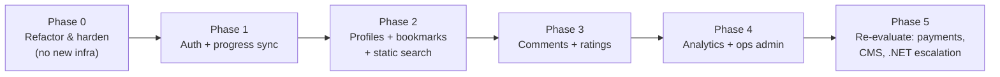

### Phase 0 — Refactor & harden (no new infrastructure)
- **Goals:** Pay down the debts that make every later phase cheaper; change zero user-visible behavior.
- **Scope:** (1) Introduce `IContentProvider` + `MdxContentProvider`, route pages through it (Step 6). (2) Kill the dual-metadata source — derive `roadmap.ts` metadata from MDX frontmatter (or vice-versa) so there's one source. (3) Replace the hardcoded `lesson-loader` map with a generated registry. (4) **Secure `/api/ai-hint`** with rate-limiting + a bot check (Turnstile) — it's a paid endpoint exposed to the world today. (5) Delete committed `out/`, fix the README.
- **Risks:** Low. Pure refactor; covered by building + smoke-testing all 56 pages.
- **Complexity:** Low.
- **Benefits:** Removes the structural blockers; the AI-cost/abuse risk is closed immediately.

### Phase 1 — Authentication + progress sync (the unlock)
- **Goals:** Introduce identity and make progress durable & cross-device — *without* removing the offline experience.
- **Scope:** Add managed auth (Auth.js + DB adapter / Clerk). Provision hosted Postgres. Implement `users`, `lesson_progress`, `points_ledger`, `user_stats` + the Progress/Users APIs (Step 10). **Keep the Zustand store as an offline-first cache**; add a sync layer (server is source of truth, local is cache). Offer a **one-time "import your local progress"** on first sign-in (`POST /me/progress/sync`). Move streak/points computation **server-side** (authoritative).
- **Risks:** Medium — auth is security-sensitive (mitigated by using a managed provider, never hand-rolling); data-merge on first login (mitigated by an explicit, idempotent import + "keep both" merge).
- **Complexity:** Medium (highest of the phases, because it's the foundation).
- **Benefits:** Unlocks *every* subsequent feature. Progress survives cache clears and syncs across devices. Gamification becomes uncheatable.

### Phase 2 — Profiles + bookmarks + static search
- **Goals:** First "platform" niceties; quick wins on the new foundation.
- **Scope:** `profiles` table + profile UI; `bookmarks` table + a "Saved" view; **build-time search index** (JSON from MDX) + client-side search UI. No new infra beyond what Phase 1 added (search needs none).
- **Risks:** Low. All additive, all behind auth except search (which is static/public).
- **Complexity:** Low.
- **Benefits:** Tangible logged-in value; search improves UX for the whole catalog with zero ops cost.

### Phase 3 — Comments + ratings
- **Goals:** Community & social proof.
- **Scope:** `comments` (threaded, with `status` moderation) + `ratings` (one-per-user upsert, with `lesson_stats` rollup) + their APIs and lesson-page UI. Add a minimal moderation action. Render comment/rating components inside the existing MDX lesson layout (data from backend, presentation reuses the component library).
- **Risks:** Medium — user-generated content brings spam/abuse/moderation and basic legal/privacy duties (mitigated: moderation status defaults, rate limits, report flow, profanity filter).
- **Complexity:** Medium.
- **Benefits:** Engagement, retention, and credibility (ratings) — and the first truly multi-user, cross-user-query features, validating the backend.

### Phase 4 — Analytics + operational admin
- **Goals:** Understand usage; give yourself tools to run the platform.
- **Scope:** Integrate a **managed analytics** product (PostHog/Plausible) — trustworthy now that users are identified. Build a small **operational admin** (moderate comments, view users/redemptions, toggle lesson `available`). Graduate the award-email flow into a proper notifications surface.
- **Risks:** Low–Medium — admin is privileged (mitigated by role-based authorization + audit logging); analytics carries privacy/consent obligations (mitigated by a privacy-respecting provider + cookie/consent handling).
- **Complexity:** Medium.
- **Benefits:** Data-driven decisions; ability to operate the community without code deploys.

### Phase 5 — Re-evaluate: payments, CMS, and .NET escalation
- **Goals:** Decide — with real usage data — whether to monetize and whether domain complexity now justifies the dedicated .NET service.
- **Scope (conditional):** If monetizing: Stripe + `subscriptions`/`entitlements` + server-side content gating. If non-engineers must author: headless CMS feeding the *same* renderer via `ApiContentProvider`. If the trigger conditions (Step 13) are met: stand up the ASP.NET Core service per Steps 8–10 and move the heaviest slices (payments, reporting, editorial) behind the unchanged API contract — **strangler-fig, one feature at a time.**
- **Risks:** High *if* monetizing (money = trust-critical; mitigated by Stripe handling card data, server-side entitlement checks, idempotent webhooks). Escalation risk is contained by the stable API contract.
- **Complexity:** High — but entered deliberately, with revenue/scale justifying it.
- **Benefits:** Sustainable monetization and enterprise-grade structure *exactly when warranted*, never before.

> **Net effect:** by the end of Phase 4 you have a full learning platform on a managed TS stack with **zero .NET and zero standing servers**. Phase 5 only fires if the business actually demands it.

---

## Step 12 — Migration Safety

| Risk class | Specific risks | Mitigations |
|---|---|---|
| **Breaking changes** | Page refactor (Phase 0) breaks lesson rendering; auth wrapper breaks public reading | Behind-the-interface refactor with **no behavior change**; build + visual smoke-test all 56 pages in CI; **content stays public** — auth gates only `/me/*`, never lesson reading; ship behind feature flags; canary deploy + instant Vercel rollback. |
| **SEO** | Moving content from SSG to client-fetched de-indexes it; URL changes lose rankings | **Keep lessons SSG/ISR — never client-only.** `ApiContentProvider` must render at build/ISR. **Preserve all `/day/[id]` URLs.** Keep per-page `generateMetadata`. If any URL must change, 301-redirect. Verify with Search Console + Lighthouse in CI. |
| **Performance** | Auth/session checks add latency to every page; DB calls slow the dashboard | Lesson pages stay static (no per-request auth on content). Session resolved at the edge. Dashboard reads hit the denormalized `user_stats`/`lesson_stats` rollups, not aggregations. Cache aggressively; DB on the read path only for `/me/*`. |
| **Data consistency** | localStorage→DB migration loses or duplicates progress; streak/points diverge between client and server | One-time **idempotent import** with explicit user consent and a "merge, keep the higher" rule; `points_ledger` with `idempotency_key` = exactly-once awards; server becomes the single source of truth, client is a cache; reconcile on sign-in; never trust client-sent totals — recompute server-side. |
| **Deployment** | New DB/auth env misconfig takes down the site; migrations lock tables; secret leakage | Content site and data layer **fail independently** — if auth/DB is down, lessons still render (graceful degradation: read-only/offline mode). Backward-compatible, non-locking migrations (expand→migrate→contract). Secrets only in server env; rotate the keys currently in `.env.local`. Staging environment mirrors prod; smoke tests gate promotion. |
| **Cost/abuse** | Unauthenticated paid AI endpoint is DoS/cost-bombed during/after migration | Close in **Phase 0**: rate-limit + Turnstile now; require auth for AI features once auth exists; per-user quotas via the ledger. |
| **Vendor lock-in** | Over-coupling to Vercel/Auth provider/BaaS | Keep the API contract + content abstraction provider-neutral; use standard Postgres (portable); Auth.js is self-hostable; the .NET escalation door is itself an exit from any BaaS ceiling. |

**Overall safety posture:** because content delivery and identity-bound state live on **independent failure domains**, no migration phase can take down the core reading experience. That property — not any single mitigation — is what makes this plan low-risk.

---

## Step 13 — Architecture Decision Record (ADR)

**ADR-001 — Backend strategy for the QA Roadmap platform**
**Status:** Proposed · **Date:** 2026-05-31 · **Decision owner:** Eng lead

### Context

`qa-roadmap` is a statically-rendered Next.js 14 + MDX bilingual course (56 lessons) with all user state in `localStorage` and two serverless functions (OpenAI proxy, Resend email). It works well, is cheap, and ranks well. The product may grow into a platform (auth, profiles, progress sync, bookmarks, comments, ratings, analytics, search, admin, notifications, possibly payments). We must choose a backend strategy that **preserves what works, minimizes risk, avoids unnecessary rewrites, and adds backend capability only where it clearly pays** — incrementally, never big-bang. The team is TS/React-centric and small.

### Decision

Adopt **Option C — Hybrid: a static MDX content core plus an incrementally-introduced, managed (BaaS-first / Next.js-native) backend, accessed through a content-provider abstraction, with a pre-designed escalation path to a dedicated ASP.NET Core (Clean Architecture/CQRS) service that is built only when explicit trigger conditions are met.**

Sequence: harden & abstract first (Phase 0, no new infra) → add managed auth + cloud progress (Phase 1) → profiles/bookmarks/static search (Phase 2) → comments/ratings (Phase 3) → analytics/ops admin (Phase 4) → re-evaluate payments/CMS/.NET (Phase 5).

### Alternatives considered

**1. Next.js only (Option A).** One TS app, Route Handlers/Server Actions, managed auth, hosted Postgres.
- *Trade-offs:* lowest complexity/cost/velocity-tax; risk of business-logic sprawl; weaker fit for genuinely complex domains (billing/editorial/reporting) and non-web clients.
- *Why not chosen as-stated:* Not rejected — **subsumed**. Hybrid *is* Option A in practice until escalation triggers fire. We chose Hybrid because it additionally (a) commits to keeping content in MDX and (b) pre-defines the .NET escalation, removing future ambiguity.

**2. Next.js + dedicated .NET backend now (Option B).** Clean Architecture, Vertical Slice, CQRS/MediatR, EF Core.
- *Trade-offs:* best separation of concerns, testability, and large-scale/complex-domain and multi-client scalability; but two languages/runtimes/pipelines, highest ops + cognitive cost, network hop, and a major early velocity tax for what is currently simple CRUD + auth.
- *Why rejected (for now):* Optimizes for scale and domain complexity the product does not yet have. Premature adoption would slow delivery and raise operational risk with no offsetting benefit. **Retained as the planned destination** under defined triggers.

**3. Hybrid (Option C) — chosen.**
- *Trade-offs:* best risk-adjusted fit; preserves content/SEO/cost/speed; additive & reversible; stays single-language until complexity justifies otherwise; requires boundary discipline and agreement on escalation triggers.

### Consequences

**Positive:**
- The live site never stops working; every step is reversible.
- Capability is added exactly at its justifying gate (auth), never ahead of need.
- Single language/toolchain preserved for maximum small-team velocity.
- Content remains a versioned, SEO-strong, near-zero-cost asset.
- A stable API contract + content abstraction make any future backend swap invisible to the front-end.

**Negative / costs:**
- Requires governance so "hybrid" doesn't decay into "ad hoc" (enforce the content abstraction via lint; document the service-layer boundary).
- Carries an *option* on .NET rather than a built system — the team must agree on triggers and revisit at Phase 5.
- Some denormalization (stats rollups, points ledger) to maintain for performance/integrity.

### Escalate to the dedicated .NET service (Option B) only when ≥2 of these are true:
1. **Payments at real scale** with complex entitlement/billing logic and reporting.
2. **A non-technical editorial team** needs rich authoring/workflow beyond Git/MDX (→ CMS + heavier catalog domain).
3. **Multiple first-class clients** (native mobile, partner API) need one shared, versioned domain API.
4. **Domain logic complexity** (authorization matrices, financial reconciliation, SLAs) outgrows what a thin service layer can keep clean.
5. **Org scaling** — multiple teams need independent, well-bounded backend ownership.

Until then, the thin TS layer carries the same domain logic, and this ADR's Steps 8–10 remain the ready blueprint.

### Final recommendation

**Do not build a dedicated backend now.** Execute **Phase 0 immediately** (pure-win refactor + closing the AI-endpoint risk), then add **managed auth + cloud progress (Phase 1)** when you commit to accounts. Keep **all teaching content in MDX permanently**. Treat the **ASP.NET Core service as a destination reached only on trigger** — design toward it, build it only when the product earns it.

---

## Appendix — Direct answers to the brief's closing questions

- **Does the project need a dedicated backend yet?** **No.** It needs the two functions it already has, a Phase-0 hardening pass, and a *plan* for managed auth.
- **What should stay MDX permanently?** Lesson bodies, documentation, roadmap structure, and (by default) blog posts — plus the authoring-as-code (Git/PR) workflow itself.
- **What should move to the backend now?** Nothing is forced *now*; the **first** thing to move (Phase 1) is **identity + progress**, because that's the gate everything else depends on.
- **What may move later?** Profiles, bookmarks, comments, ratings, notifications, operational analytics/admin, and — conditionally — payments and CMS-authored content.
- **What should never be migrated off MDX?** The teaching prose and its content-as-code workflow. Even with a full backend and CMS, lessons should remain MDX-rendered; only the *authoring entry point* (Git vs CMS) may change.


